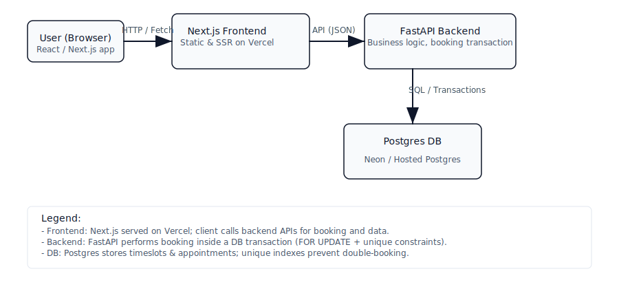

**Project Architecture & Design Decisions**

This document summarizes the architecture and design decisions for the take-home-assignment. It covers the backend and frontend choices, database schema and safety measures, concurrency testing, and developer tooling.

**Table of Contents**
- Overview
- Backend
  - Frameworks & libraries
  - DB schema & constraints
  - Booking / concurrency strategy
  - Session & helper design
- Frontend
  - Frameworks & conventions
  - Theming & dark mode
  - Key components & responsibilities
- Testing & Concurrency Verification
- Tooling, Linting & Formatting
- Architecture Diagram
- Next steps

---

**Overview**

The app is a full stack booking application with a FastAPI backend (Python) and a Next.js frontend (TypeScript + React). The design emphasizes safety for booking operations (no double-booking), clear frontend theming (semantic tokens + Tailwind) using a base UI design that is very common as per some scouring on Dribbble, and developer-friendly tooling (ruff linting, simple test scripts).

The frontend is hosted at: https://decoda-booking.vercel.app
The backend is hosted at: https://decoda-nvi3.onrender.com
The DB is hosted on neon.tech
I added the schema as a SQL dump: [schema.sql](./schema.sql)
To run things locally you need an env file with `NEXT_PUBLIC_API_URL` on the frontend and an env file with `DATABASE_URL` on the backend. With the given schema you can host your data on any PostgreSQL database.


---

**Backend**

- Frameworks & libraries
  - FastAPI for HTTP endpoints (`backend/main.py`).
  - SQLAlchemy ORM for models and DB access (`backend/db/tables/tables.py`, `backend/db/database.py`).
  - Pydantic (v2-style models) for request/response validation (`backend/models.py`).

- DB schema & constraints
  - Tables: `Provider`, `Patient`, `TimeSlot`, `Appointment` (see `backend/db/tables/tables.py`).
  - Important uniqueness constraints (applied as DB-level indexes):
    - unique (provider_id, start_time) on `time_slots` (prevents duplicate timeslot rows for the same provider/time).
    - unique partial index on `appointments(slot_id)` for non-cancelled rows (ensures only 1 active appointment per timeslot).
  - These DB constraints act as a final safety net in addition to application-level transaction logic.

- Booking / concurrency strategy
  - Booking must be atomic and avoid race conditions.
  - Pattern used in `backend/main.py` (booking endpoint):
    1. Begin a DB transaction (request-scoped `db` session is used).
    2. Try to select the relevant `TimeSlot` `SELECT ... FOR UPDATE` (row-level lock) if it exists.
    3. If the timeslot does not exist, attempt to `INSERT` it. On IntegrityError (concurrent insert), rollback and re-query with `FOR UPDATE`.
    4. While the `FOR UPDATE` lock holds, confirm the slot is still available and create the `Appointment` in the same transaction.
    5. Commit the transaction.
  - This creates a serialized critical section around timeslot creation / appointment insert so only one booking can succeed for the same timeslot.

- Session & helper design
  - Helpers in `backend/helpers.py` were refactored to be transaction-aware. `create_appointment` flushes but does not commit when caller-supplied session is passed, to ensure transactional atomicity is controlled by the caller endpoint.
  - A small `_session_scope(db)` helper centralizes session opening/closing patterns used by helpers to reduce duplication.

---

**Frontend**

- Frameworks & conventions
  - Next.js App Router (app/), TypeScript, Tailwind CSS.
  - Components are small and composable; a `ui/` collection holds shared UI primitives (Card, Button, Badge, etc.).
  - Color tokens live in `frontend/app/globals.css` and follow CSS variables for theme switching (light/dark). Components use semantic tokens (e.g. `bg-card`, `text-muted-foreground`) so themes are centralized.

- Theming & dark mode
  - Theme tokens defined in `:root` (light) and `.dark` (dark). Tailwind utility classes reference those tokens via `bg-card`, `bg-muted`, `text-foreground`, etc.
  - A small client component `frontend/components/DarkModeToggle.tsx` toggles the `.dark` class on `document.documentElement` and persists the preference to `localStorage`.
  - I updated several components to replace `bg-white`/`bg-gray-*` with theme-aware tokens so the UI remains readable and consistent in dark mode.

- Key components & responsibilities (high-level)
  - `DoctorCalendar` (`frontend/components/DoctorCalendar.tsx`): calendar UI for monthly, weekly and daily views for schedule.
  - `DayCell` (`frontend/components/ui/DayCell.tsx`): renders day cells, appointments summary (uses `TAG_COLORS` for pill colors).
  - `TimeSlotPicker` (`frontend/components/TimeSlotPicker.tsx`): lists available times, shows the sticky summary banner and the Book button.
  - `BookingForm` (`frontend/components/BookingForm.tsx`): client-side validation (react-hook-form + zod) and submit flow.

---

**Testing & Concurrency Verification**

- Concurrency tests
  - Two scripts live under `backend/tests/`:
    - `concurrency_test.py` — lightweight concurrent request tester.
    - `concurrency_assertive_test.py` — assertive runner that fires N concurrent requests, verifies exactly one success per timeslot, and reports latency metrics.
  - These tests hit the running API (so run them against a local or test instance) and were used to verify the booking endpoint logic; an example run the developer executed was `python backend/tests/concurrency_assertive_test.py --iter 5 --concurrency 10`.

---

**Tooling, Linting & Formatting**

- Python: `ruff` is used for linting/formatting (pinned to `ruff==0.14.5` in `backend/requirements.txt`); `pyproject.toml` contains `tool.ruff.lint` config (line length 120, some rules ignored temporarily like `C901` where complexity refactors are pending).
- Frontend: Tailwind CSS integrated, project uses TypeScript checks.

---

**Architecture Diagram**

The architecture diagram shows the main request flow and where critical services live (frontend, backend, database, and monitoring). The SVG lives at `docs/architecture.svg` and is embedded below.



If your renderer doesn't display SVGs, here's a simple ASCII fallback:

```
User (Browser)  -->  Next.js Frontend (Vercel)
                              |
                              v
                      FastAPI Backend (Booking logic)
                              |
                              v
                        Postgres (Neon)

```

Notes:
- The frontend (Next.js) serves client pages and calls backend APIs for booking and data.
- The backend (FastAPI) executes booking transactions using DB row-level locks and unique constraints.
- The database is Postgres (schema in `schema.sql`).

---

**Next steps / Recommendations**

- Refactor high-complexity functions (noted by `C901` linter warnings). The two candidates are `create_appointment` and the booking flow — split responsibilities into smaller, testable helpers. (maybe make a get_or_create_timeslot helper function to ease the load on the logic)
- Add CI jobs via GHA: `ruff check`, frontend lint and build, and a test job (could run concurrency tests against a disposable DB container).
- Optional DB-check: Since I used PostgreSQL, consider using INSERT ... ON CONFLICT DO NOTHING RETURNING (or INSERT .. ON CONFLICT .. DO UPDATE) as an alternative to the try-flush / IntegrityError fallback in high-throughput systems — but the current approach with FOR UPDATE + unique index is correct and reliable.
- Convert the assertive concurrency script into a pytest-compatible test and run it in CI with a controlled DB to guard against regressions.
- I Created a view for appointments in the DB, look into using that in the future.
- Use Alembic or something to manage DB migrations
- Login workflow ideally just using something straightforward like Auth0 or Firebase
- Metrics and Logging/Tracing. Currently the only thing we have is Vercel Analytics which is not enough.
